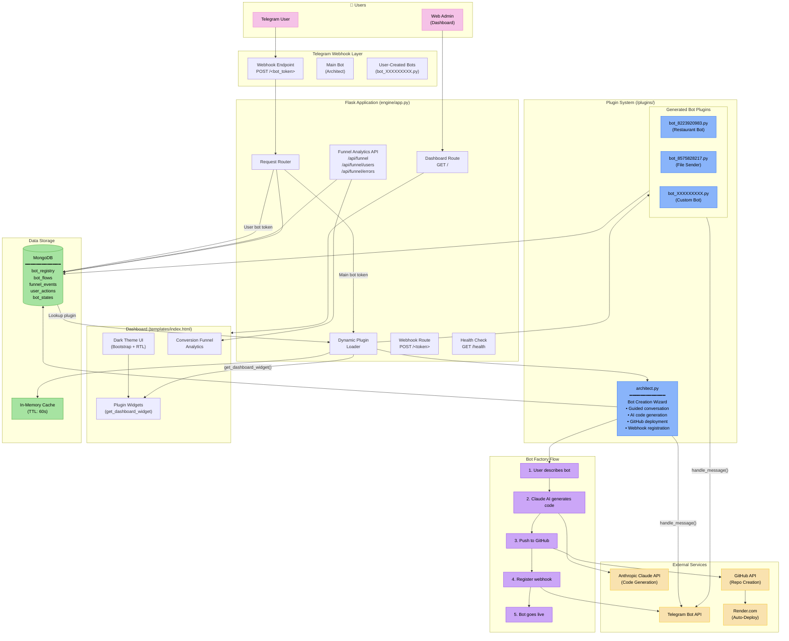
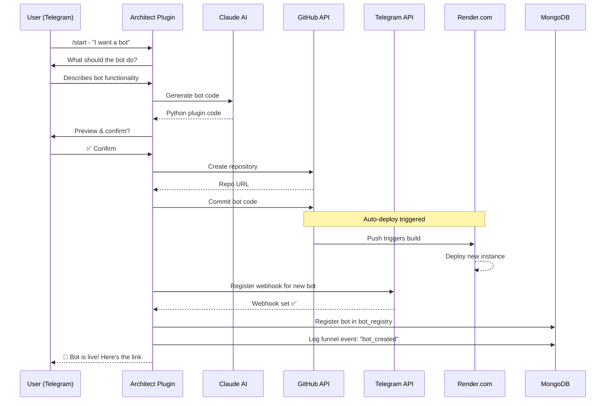
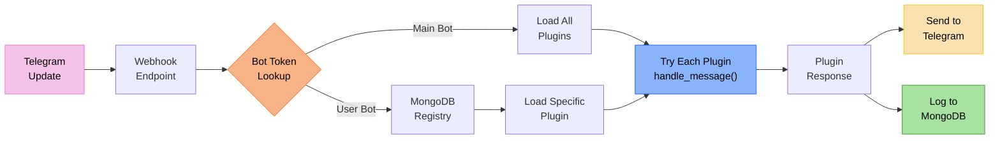
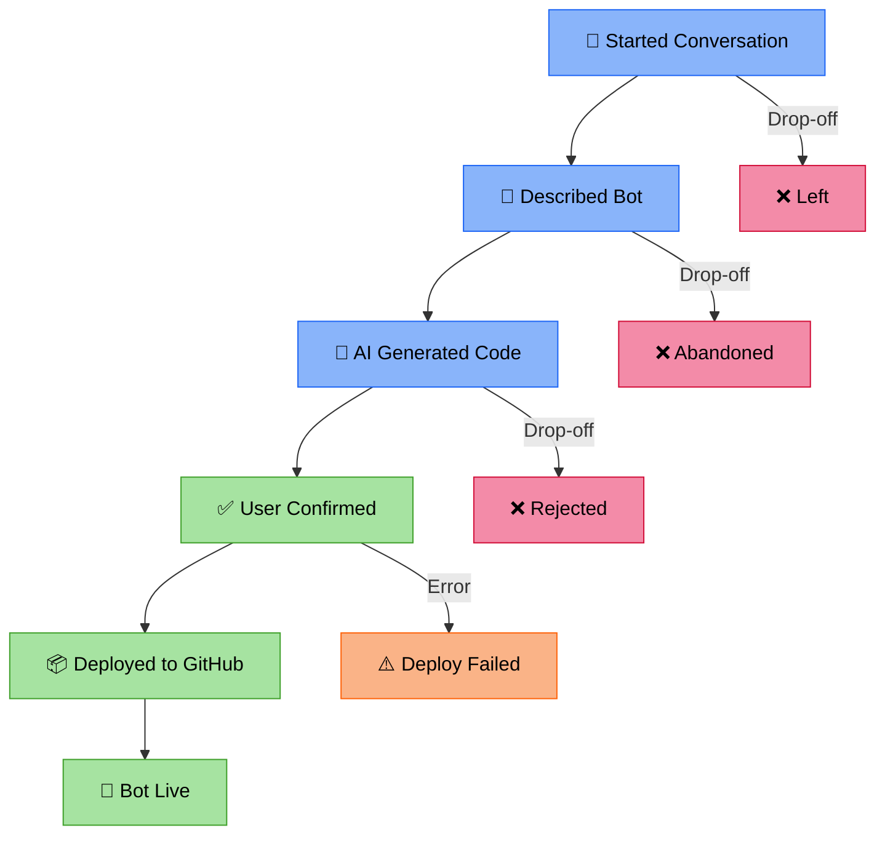

# Architecture Diagram - Modular Bot V2

## System Overview

```mermaid
graph TB
    subgraph Users["👥 Users"]
        TelegramUser["Telegram User"]
        WebAdmin["Web Admin<br/>(Dashboard)"]
    end

    subgraph TelegramLayer["Telegram Webhook Layer"]
        Webhook["Webhook Endpoint<br/>POST /&lt;bot_token&gt;"]
        MainBot["Main Bot<br/>(Architect)"]
        UserBots["User-Created Bots<br/>(bot_XXXXXXXXX.py)"]
    end

    subgraph FlaskApp["Flask Application (engine/app.py)"]
        Router["Request Router"]
        PluginLoader["Dynamic Plugin<br/>Loader"]
        DashboardRoute["Dashboard Route<br/>GET /"]
        WebhookRoute["Webhook Route<br/>POST /&lt;token&gt;"]
        FunnelAPI["Funnel Analytics API<br/>/api/funnel<br/>/api/funnel/users<br/>/api/funnel/errors"]
        HealthAPI["Health Check<br/>GET /health"]
    end

    subgraph PluginSystem["Plugin System (/plugins/)"]
        Architect["architect.py<br/>━━━━━━━━━━━━━<br/>Bot Creation Wizard<br/>• Guided conversation<br/>• AI code generation<br/>• GitHub deployment<br/>• Webhook registration"]

        subgraph GeneratedBots["Generated Bot Plugins"]
            Bot1["bot_8223920983.py<br/>(Restaurant Bot)"]
            Bot2["bot_8575828217.py<br/>(File Sender)"]
            BotN["bot_XXXXXXXXX.py<br/>(Custom Bot)"]
        end
    end

    subgraph BotCreationFlow["Bot Factory Flow"]
        Step1["1. User describes bot"]
        Step2["2. Claude AI generates code"]
        Step3["3. Push to GitHub"]
        Step4["4. Register webhook"]
        Step5["5. Bot goes live"]
    end

    subgraph Dashboard["Dashboard (templates/index.html)"]
        DarkUI["Dark Theme UI<br/>(Bootstrap + RTL)"]
        Widgets["Plugin Widgets<br/>(get_dashboard_widget)"]
        FunnelView["Conversion Funnel<br/>Analytics"]
    end

    subgraph Storage["Data Storage"]
        MongoDB[("MongoDB<br/>━━━━━━━━━━━━━<br/>bot_registry<br/>bot_flows<br/>funnel_events<br/>user_actions<br/>bot_states")]
        Cache["In-Memory Cache<br/>(TTL: 60s)"]
    end

    subgraph ExternalAPIs["External Services"]
        TelegramAPI["Telegram Bot API"]
        ClaudeAI["Anthropic Claude API<br/>(Code Generation)"]
        GitHubAPI["GitHub API<br/>(Repo Creation)"]
        RenderCom["Render.com<br/>(Auto-Deploy)"]
    end

    %% User interactions
    TelegramUser --> Webhook
    WebAdmin --> DashboardRoute

    %% Webhook routing
    Webhook --> Router
    Router -->|"Main bot token"| PluginLoader
    Router -->|"User bot token"| MongoDB
    MongoDB -->|"Lookup plugin"| PluginLoader
    PluginLoader --> Architect
    PluginLoader --> GeneratedBots

    %% Plugin message handling
    Architect -->|"handle_message()"| TelegramAPI
    GeneratedBots -->|"handle_message()"| TelegramAPI

    %% Bot creation flow
    Architect --> Step1
    Step1 --> Step2
    Step2 --> Step3
    Step3 --> Step4
    Step4 --> Step5
    Step2 --> ClaudeAI
    Step3 --> GitHubAPI
    Step4 --> TelegramAPI
    GitHubAPI --> RenderCom

    %% Dashboard
    DashboardRoute --> Dashboard
    DarkUI --> Widgets
    PluginLoader -->|"get_dashboard_widget()"| Widgets
    FunnelAPI --> FunnelView
    FunnelAPI --> MongoDB

    %% Analytics
    Router --> MongoDB
    Architect --> MongoDB
    GeneratedBots --> MongoDB

    %% Cache
    PluginLoader --> Cache

    %% Styling
    classDef external fill:#f9e2af,stroke:#f5c211,color:#000
    classDef storage fill:#a6e3a1,stroke:#40a02b,color:#000
    classDef plugin fill:#89b4fa,stroke:#1e66f5,color:#000
    classDef user fill:#f5c2e7,stroke:#ea76cb,color:#000
    classDef factory fill:#cba6f7,stroke:#8839ef,color:#000

    class TelegramAPI,ClaudeAI,GitHubAPI,RenderCom external
    class MongoDB,Cache storage
    class Architect,Bot1,Bot2,BotN plugin
    class TelegramUser,WebAdmin user
    class Step1,Step2,Step3,Step4,Step5 factory
```

## Bot Creation Flow (Architect Plugin)

```mermaid
sequenceDiagram
    participant U as User (Telegram)
    participant A as Architect Plugin
    participant AI as Claude AI
    participant GH as GitHub API
    participant TG as Telegram API
    participant R as Render.com
    participant DB as MongoDB

    U->>A: /start - "I want a bot"
    A->>U: What should the bot do?
    U->>A: Describes bot functionality

    A->>AI: Generate bot code
    AI-->>A: Python plugin code

    A->>U: Preview & confirm?
    U->>A: ✅ Confirm

    A->>GH: Create repository
    GH-->>A: Repo URL
    A->>GH: Commit bot code

    Note over GH,R: Auto-deploy triggered
    GH->>R: Push triggers build
    R-->>R: Deploy new instance

    A->>TG: Register webhook for new bot
    TG-->>A: Webhook set ✅

    A->>DB: Register bot in bot_registry
    A->>DB: Log funnel event: "bot_created"

    A-->>U: 🎉 Bot is live! Here's the link
```

## Request Processing Pipeline

```mermaid
graph LR
    A["Telegram<br/>Update"] --> B["Webhook<br/>Endpoint"]
    B --> C{"Bot Token<br/>Lookup"}
    C -->|"Main Bot"| D["Load All<br/>Plugins"]
    C -->|"User Bot"| E["MongoDB<br/>Registry"]
    E --> F["Load Specific<br/>Plugin"]
    D --> G["Try Each Plugin<br/>handle_message()"]
    F --> G
    G --> H["Plugin<br/>Response"]
    H --> I["Send to<br/>Telegram"]
    H --> J["Log to<br/>MongoDB"]

    style A fill:#f5c2e7,stroke:#ea76cb,color:#000
    style C fill:#fab387,stroke:#fe640b,color:#000
    style G fill:#89b4fa,stroke:#1e66f5,color:#000
    style I fill:#f9e2af,stroke:#f5c211,color:#000
    style J fill:#a6e3a1,stroke:#40a02b,color:#000
```

## Conversion Funnel Analytics

```mermaid
graph TD
    F1["👋 Started Conversation"] --> F2["📝 Described Bot"]
    F2 --> F3["🤖 AI Generated Code"]
    F3 --> F4["✅ User Confirmed"]
    F4 --> F5["📦 Deployed to GitHub"]
    F5 --> F6["🚀 Bot Live"]

    F1 -->|"Drop-off"| X1["❌ Left"]
    F2 -->|"Drop-off"| X2["❌ Abandoned"]
    F3 -->|"Drop-off"| X3["❌ Rejected"]
    F4 -->|"Error"| X4["⚠️ Deploy Failed"]

    style F1 fill:#89b4fa,stroke:#1e66f5,color:#000
    style F2 fill:#89b4fa,stroke:#1e66f5,color:#000
    style F3 fill:#89b4fa,stroke:#1e66f5,color:#000
    style F4 fill:#a6e3a1,stroke:#40a02b,color:#000
    style F5 fill:#a6e3a1,stroke:#40a02b,color:#000
    style F6 fill:#a6e3a1,stroke:#40a02b,color:#000
    style X1 fill:#f38ba8,stroke:#d20f39,color:#000
    style X2 fill:#f38ba8,stroke:#d20f39,color:#000
    style X3 fill:#f38ba8,stroke:#d20f39,color:#000
    style X4 fill:#fab387,stroke:#fe640b,color:#000
```
